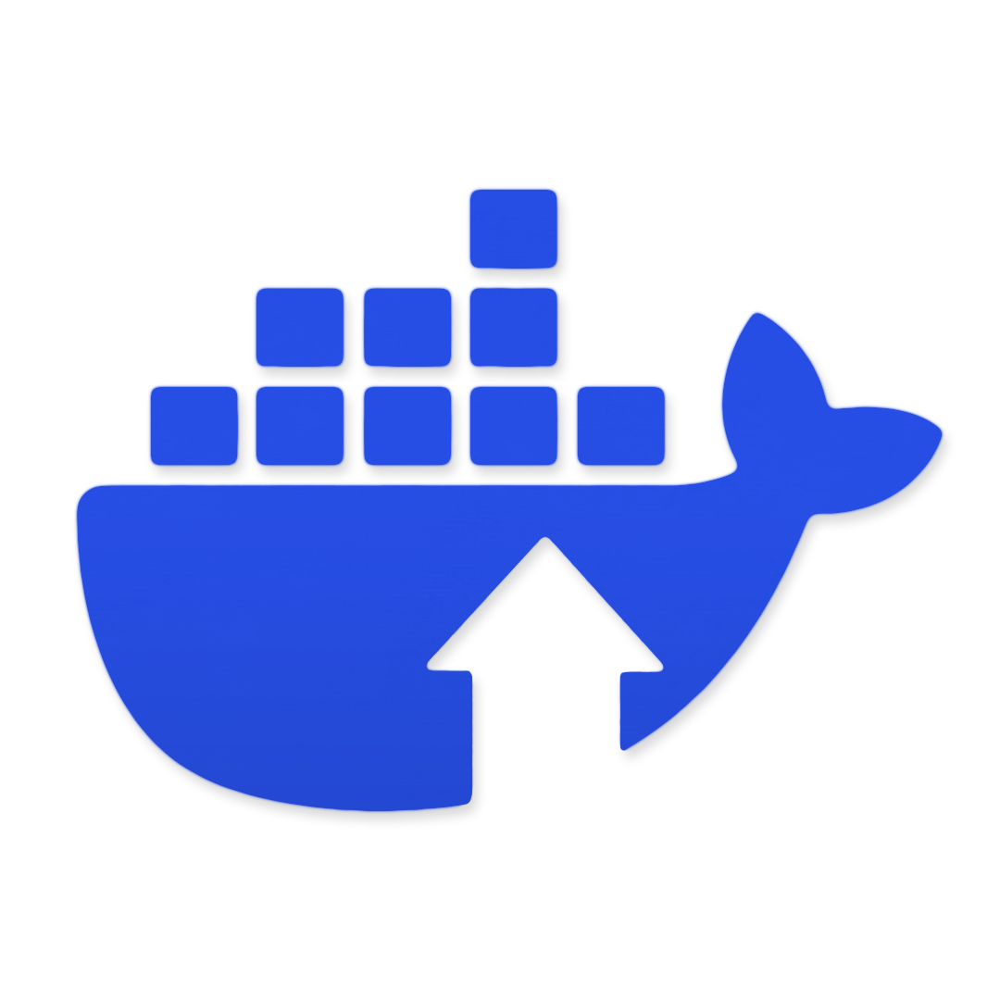

# Dockup

Docker Engine in a dedicated WSL distro, driven from Windows. No Docker
Desktop, no services, no autostart unless you ask for it: one static
`dockup.exe` installs Debian into WSL as `dockup`, runs dockerd there under
systemd, and bridges the Windows Docker CLI to it over a named pipe
(plus an optional `127.0.0.1` TCP bridge).

## Why dockup?

- **One distro, one job.** A disposable Debian distro named `dockup` that
  exists only to run the Docker daemon. Your other distros are never touched.
- **Native CLI feel.** `run -it`, `exec`, `logs -f`, and Compose all behave
  natively over a raw byte-copy bridge — no `-i` workarounds, no TCP ports,
  no firewall rules by default.
- **Nothing runs unless you start it.** Foreground (`dockup`) or background
  (`dockup daemon start`) — plus opt-in startup at Windows login.
- **Self-healing.** `doctor` repairs stale state, `--fix` rebuilds a broken
  engine, and `restore` resets tampering while keeping your images.

## Quickstart

```powershell
dockup setup                  # install the dockup distro (asks where + which arch)
dockup daemon start           # run in the background
docker -H npipe:////./pipe/dockup_engine run --rm hello-world
dockup daemon stop            # stop when done
```

Or run in the foreground with `dockup` (Ctrl+C stops it).

## Commands

| Command | What it does |
|---|---|
| `dockup` | Foreground run, logs inline, Ctrl+C stops |
| `dockup setup [--amd\|--arm] [--path=DIR] [--dry-run]` | Install the distro, Docker, systemd config; verify |
| `dockup uninstall` | Remove the distro and its state (keeps your default path) |
| `dockup restore [--full]` | Reset tampering (light) or reinstall from scratch (`--full`) |
| `dockup ps` | `STATUS` (`running`/`starting...`/`stopped`) + `AUTOSTART` table |
| `dockup daemon start\|stop\|restart\|status\|log` | Background process management + log follow |
| `dockup daemon autostart [on\|off]` | Show or set starting at Windows login (default off) |
| `dockup shutdown` | Stop everything and terminate the distro |
| `dockup doctor [--fix]` | Health checks; `--fix` reinstalls/repairs a broken engine |
| `dockup upgrade` | Update the in-distro engine to the latest versions |
| `dockup version` | Show the version |
| `dockup help [command]` | Help (`-h`/`--help` work on every command) |

## Where to go next

- **Using dockup?** Start with [Installation](guides/installation.md), then
  [Getting Started](guides/getting-started.md).
- **Hacking on dockup?** Read [Architecture](developers/architecture.md), then
  [Building & Testing](developers/building-testing.md).
- **Want to help?** See [Contributing](contributing.md).
